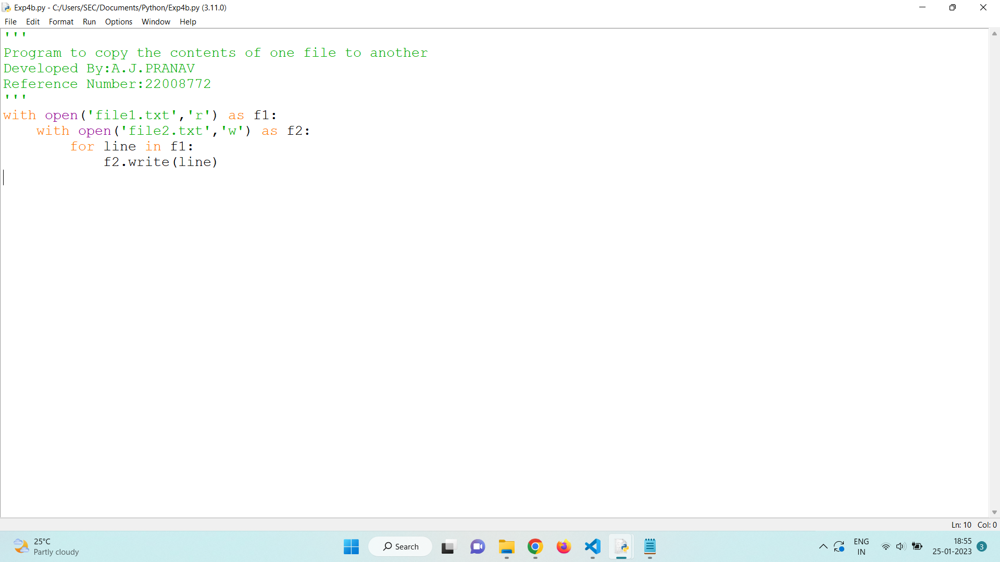

# copy-file
## AIM:
To write a python program for copying the contents from one file to another file.
## EQUIPEMENT'S REQUIRED: 
PC
Anaconda - Python 3.7
## ALGORITHM: 
### Step 1:
Open a text file using the open() function in read mode.
### Step 2: 
Open the second file to which you want to copy the contents to.
### Step 3: 
Open the second file in write mode.
### Step 4:  
Using the for loop,iterate through the first file.
### Step 5: 
Write the contents in the second file.
### Step 6: 
End the program.
## PROGRAM:
```python
'''
Program to copy the contents of one file to another
Developed By:A.J.PRANAV
Reference Number:22008772
'''
with open('file1.txt','r') as f1:
    with open('file2.txt','w') as f2:
        for line in f1:
            f2.write(line)
```
### OUTPUT:



## RESULT:
Thus the program is written to copy the contents from one file to another file.